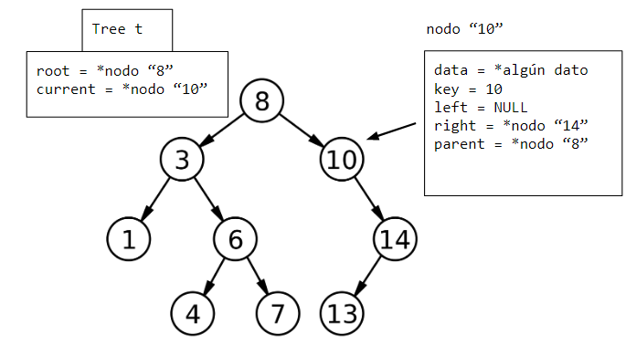
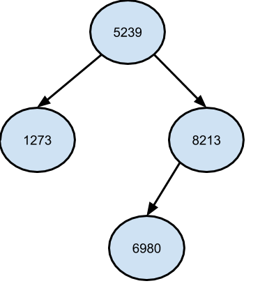

Implementando un Mapa Ordenado (TreeMap)
=====

---
**Antes de comenzar**

* Para resolver el laboratorio debe conectarse a Repl.it. 
* Sólo puede modificar los archivos *treemap.c* y *main.c*
* Puede revisar el archivo *test.c* para entender los errores de su código
* Para testear sus códigos debe hacer click en Run▸
* No está permitido usar comandos de git (a menos que el profesor lo indique)
* Para probar su código terminado, puede compilar y ejectuar el main así:
        
        gcc main.c treemap.c; ./a.out

---

En este laboratorio implementaremos un **mapa ordenado**. Para ello usaremos la siguiente estructura (árbol binario de búsqueda):

    struct TreeNode {
        void* key;
        void * value;
        TreeNode * left;
        TreeNode * right;
        TreeNode * parent;
    };

    struct TreeMap {
        TreeNode * root;
        TreeNode * current;
        int (*lower_than) (void* key1, void* key2);
    };

Como se pueden dar cuenta, los nodos del árbol incluyen los elementos/pares que almacenará la estructura (key, value). La clave (key) es void* por lo que puede ser un puntero a cualquier tipo de dato.

El árbol binario de búsqueda *ordena los datos usando las claves*, por lo tanto necesita una función para comparar claves. Esta función se incluye en la estructura y se inicializará al momento de crear el TreeMap. La función se incluye de esta manera:

    int(*lower_than) (void* key1, void* key2);

El nombre de la función es *lower_than*, recibe dos parámetros (las claves) y retorna un entero (1 si key1<key2 y 0 si no).

En el main, para crear un mapa deberemos pasar una función para comparar sus claves. Por ejemplo, si estamos creando un mapa con claves de tipo entero deberíamos hacer lo siguiente:
    
    /* definimos una función para comparar claves de tipo int */
    int lower_than_int(void* key1, void* key2){
        int k1 = *((int*) (key1));
        int k2 = *((int*) (key2));
        return k1<k2;
    }

    int main(){
        /*creamos el mapa pasando la función. */
        TreeMap* map = TreeMap(lower_than_int);
        ...
    }

Ejercicios
----

Puede usar la siguiente función para crear nodos del árbol.

    TreeNode* createTreeNode(void* key, void * value) {
        TreeNode * new = (TreeNode *)malloc(sizeof(TreeNode));
        if (new == NULL) return NULL;
        new->key = key;
        new->value = value;
        new->parent = new->left = new->right = NULL;
        return new;
    }

Para utilizar la función *lower_than* de un mapa, debe hacerlo de la siguiente manera (asumiendo que la variable TreeMap* map está definida):

    int resultado = map->lower_than(key1,key2);
Esta función retorna 1 si key1<key2. 

También puede usar la siguiente función para saber si dos claves son iguales. 

    //retorna 1 si las claves son iguales y 0 si no lo son
    int is_equal(TreeMap* tree, void* key1, void* key2){
        if(tree->lower_than(key1,key2)==0 &&  
            tree->lower_than(key2,key1)==0) return 1;
        else return 0;
    }

En las pruebas de código se usa el tipo de dato **Palabra** que tiene la siguiente estructura y función constructora.

    typedef struct{
        int id;
        char* word;
    }Palabra;

    Palabra* creaPalabra(int id, char* word){
        Palabra* new = (Palabra*) malloc(sizeof(Palabra));
        new->id = id;
        new->word = _strdup(word);
    }

Además se usa un árbol como el de la figura (sólo se muestran las claves) inicializado con el siguiente código

    TreeMap * tree = (TreeMap *)malloc(sizeof(TreeMap));
    tree->lower_than = lower_than_int; 
    Palabra* p=creaPalabra(5239,"auto");
    tree->root=createTreeNode(&p->id, p);
    p=creaPalabra(8213,"rayo");
    tree->root->right=createTreeNode(&p->id, p);
    tree->root->right->parent=tree->root;
    p=creaPalabra(6980,"hoja");
    tree->root->right->left=createTreeNode(&p->id, p);
    tree->root->right->left->parent=tree->root->right;
    p=creaPalabra(1273,"reto");
    tree->root->left=createTreeNode(&p->id, p);
    tree->root->left->parent=tree->root;

Las pruebas/tests se encuentran en el archivo *test.c*

[Revise las diapositivas](https://docs.google.com/presentation/d/1KXoJLL5XZsXgprXxIs-0zaWq-6i0tVbPa5kOIZQKbSU/edit#slide=id.p) si necesita más detalles para implementar las operaciones. También puede consultar el capítulo 12 del libro **Introduction to Algorithms**.

1.- Implemente la función *createTreeMap* en el archivo treemap.c. Esta función recibe la función de comparación de claves y crea un mapa (TreeMap) inicializando sus variables. 
El siguiente código muestra como inicializar la función de comparación. Reserve memoria, inicialice el resto de variables y retorne el mapa.

    TreeMap * createTreeMap(int (*lt) (void* key1, void* key2)) {

        //map->lower_than = lt;
        return NULL;
    }

2.- Implemente la función void* searchTreeMap(TreeMap* tree, void* key), la cual busca el nodo con clave igual a key y retorna el **valor** asociado al nodo. Si no se encuentra la clave retorna NULL.
Recuerde hacer que el current apunte al nodo encontrado.

    void* searchTreeMap(TreeMap* tree, void* key) {

        return NULL;
    }

3.- Implemente la función void insertTreeMap(TreeMap * tree, void* key, void * value). Esta función inserta un nuevo dato (key,value) en el árbol y hace que el current apunte al nuevo nodo.
Para insertar un dato, primero debe realizar una búsqueda para encontrar donde debería ubicarse. Luego crear el nuevo nodo y enlazarlo. Si la clave del dato ya existe retorne sin hacer nada (recuerde que el mapa no permite claves repetidas).
   
    void insertTreeMap(TreeMap* tree, void* key, void* value){

    }

4.- Implemente la función TreeNode * minimum(TreeNode * x). Esta función retorna el **nodo con la mínima clave** ubicado en el subárbol con raiz x. Para obtener el nodo tiene que, a partir del nodo x, irse por la rama izquierda hasta llegar al final del subárbol. Si x no tiene hijo izquierdo se retorna el mismo nodo.
   
    TreeNode * minimum(TreeNode * x){

        return NULL;
    }

5.- Implemente la función void removeNode(TreeMap * tree, TreeNode* node). Esta función elimina el nodo *node* del árbol *tree*. Recuerde que para eliminar un node existen 3 casos:
**Nodo sin hijos:** Se anula el puntero del padre que apuntaba al nodo
**Nodo con un hijo:** El padre del nodo pasa a ser padre de su hijo
**Nodo con dos hijos:** Descienda al hijo izquierdo y obtenga el menor nodo del subárbol (con la función minimum). Reemplace los datos (key,value) de *node* con los del nodo "minimum". Elimine el nodo minimum (para hacerlo puede usar la misma función *removeNode*).

    void removeNode(TreeMap * tree, TreeNode* node) {

    }

La función removeNode será usada por la función *eraseTreeMap* para eliminar datos del árbol usando la clave.

    void eraseTreeMap(TreeMap * tree, void* key){
        if (tree == NULL || tree->root == NULL) return;
        if (searchTreeMap(tree, key) == NULL) return;
        TreeNode* node = tree->current;
        removeNode(tree, node);
    } 

6.- Implemente las funciones para recorrer la estructura: void* firstTreeMap(TreeMap* tree) retorna el primer **valor** del mapa (el menor). void* nextTreeMap(TreeMap* tree)  retornar el siguiente **valor** del mapa a partir del puntero TreeNode* current. Recuerde actualizar este puntero.

    void * firstTreeMap(TreeMap * tree) {
        

        return NULL;
    }

    void * nextTreeMap(TreeMap * tree) {
       

        return NULL;
    }

7.- La función void* upperBound(TreeMap* tree, void* key) retorna el **valor** con clave igual a key. En caso de no encontrarlo retorna el primer valor asociado a una clave mayor o igual a key. 
Para implementarla puede realizar una búsqueda normal y usar un puntero a nodo auxiliar ub_node que vaya guardando el nodo con la menor clave *mayor o igual a key*. Finalmente retorne el valor del nodo ub\_node.

    void* upperBound(TreeMap* tree, void* key){
        

    }

Ya puede comenzar a utilizar su mapa! Para partir puede crear un archivo *main.c* con un código como el siguiente:

    #include <stdio.h>
    #include <stdlib.h>
    #include <string.h>
    #include "treemap.h"

    /* Función para comparar claves de tipo string */
    int lower_than_string(void* key1, void* key2){
        char* k1=(char*) key1;
        char* k2=(char*) key2;
        if(strcmp(k1,k2)<0) return 1;
        return 0;
    }

    int main(){
        TreeMap* map = createTreeMap(lower_than_string);
        char words[9][5] = {"saco","cese","case","cosa",
        "casa","cesa","cose","seco","saca"};

        int i=0;
        for(;i<9; i++){
            insertTreeMap(map,_strdup(words[i]),_strdup(words[i]));
        }

        char* aux= firstTreeMap(map);
        while(aux!=NULL){
            printf("%s\n", aux);
            aux=nextTreeMap(map);
        }

    }

Luego para compilar y ejecutar:

    gcc main.c treemap.c -o main
    ./main 

Y voilá!